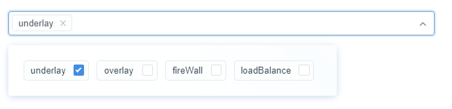

# 基于iview的下拉选择组件

> Author : Wenfang zhu

> version: 1.0.0

> Date: 2019/10/24

# Usage
```
<Dropdown
    :data="dropdownData"
    :dropDown="chosenDropData"
    v-on:chosenItems="operateItems"
    v-on:deleteItems="operateItems"
></Dropdown>
...

data() {
    return {
        dropdownData: ['underlay', 'overlay', 'fireWall', 'loadBalance'], // 下拉框默认数据
        chosenDropData: {
            chosenItems: []
        }, // 下拉框选中的数据
    }
}
```
## The preview image


# license
* MIT